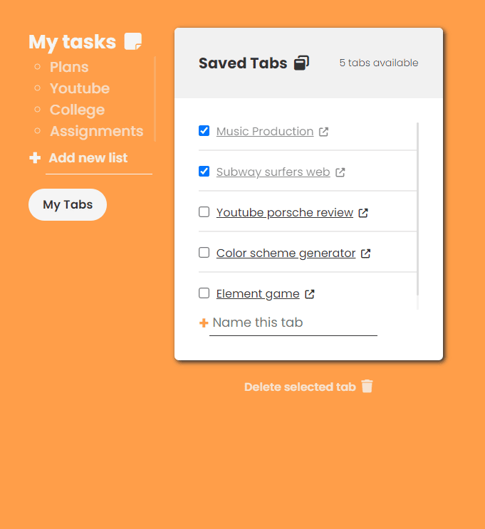
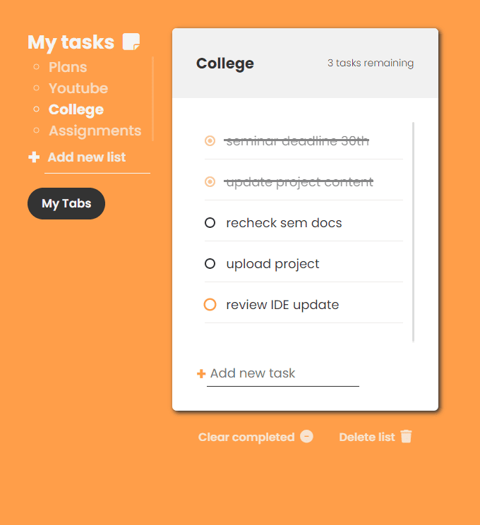

# 🚀 ClipNote: The Minimal Chrome Productivity Tool

[](https://github.com/Tejasgaware17/ClipNote)
[](LICENSE)

A clean, **lightweight Chrome extension** for saving quick notes, managing tasks, and bookmarking important tabs.

ClipNote is a fast, minimal, and **offline-friendly** productivity tool designed for quickly storing temporary notes and saving useful tabs — all **without login, accounts, or cloud services**. Built with vanilla JavaScript, HTML, and CSS, it focuses on simplicity and speed.

---

## 💡 Why ClipNote?

Managing dozens of tabs across different websites quickly became overwhelming in my daily workflow. Important links would get lost in a cluttered browser window, leading to frustration and wasted time digging through history.

ClipNote was built to solve this problem: to be a simple, fast way to **save important tabs and notes directly inside the browser**. It helps you keep track of the sites you need, revisit pages effortlessly, and avoid the frustration of forgetting links you may need later.

---

## ✨ Features

* **📝 Quick Notes** — Add, edit, and delete notes effortlessly.
* **⭐ Save Favorite Tabs** — Store important tabs for easy reopening with a single click.
* **⚡ Fast & Lightweight** — Zero external dependencies for smooth, instant performance.
* **📦 Offline Support** — Data is stored locally and securely using Chrome's built-in storage.
* **🎨 Minimal UI** — Clean, distraction-free, and easy-to-use interface.
* **🔧 Developer-Friendly** — Simple file structure and **no build tools required**.

---

## 🛠️ Tech Stack

ClipNote is built entirely with core web technologies, ensuring maximum speed and minimal file size.

* **HTML, CSS, JavaScript (Vanilla)**
* **Chrome Extensions API**
* **Chrome Local Storage** (For offline data persistence)

---

## 📦 Installation (Developer Mode)

To install and run ClipNote locally as a developer:

1.  **Clone the repository:**
    ```bash
    git clone [https://github.com/Tejasgaware17/ClipNote.git](https://github.com/Tejasgaware17/ClipNote.git)
    ```

2.  **Open Chrome and navigate to:**
    ```bash
    chrome://extensions
    ```

3.  **Enable `Developer mode`** using the toggle switch in the top-right corner.

4.  **Click the `Load unpacked` button**.

5.  **Select the root `ClipNote` directory** from the folder you cloned.

The extension will now be available in your Chrome toolbar.

---

## 📸 Screenshots

| Managing Notes | Managing Saved Tabs | Browser View |
| :---: | :---: | :---: |
|  |  |  |

---

## 📁 Project Structure & How It Works

The project structure is designed for maximum clarity and ease of development.
```
  # ClipNote/
    ├─ assets/             # Screenshots and demo images
    ├─ manifest.json       # Chrome extension configuration 
    ├─ index.html          # The main extension UI
    ├─ style.css           # UI styles
    └─ script.js           # All notes and tab-saving logic
```
  
* All notes and saved tabs are persisted using `chrome.storage.local`.
* Tab saving functionality utilizes the **Chrome Tabs API**.
* All UI interactions and rendering are handled purely through **vanilla JavaScript**.
* **No backend, no build tools** — simple and developer-friendly.

---

### 🔧 Development

To quickly modify or extend ClipNote:

1.  Edit `script.js` for logic changes or `style.css` for UI customizations.
2.  Reload the extension by navigating to `chrome://extensions` and clicking the **Reload** button for ClipNote.
3.  Test changes instantly (no lengthy build step required).

---

## 🤝 Contributing

Contributions are welcome! If you have suggestions or want to improve the extension:

1.  **Fork** this repository.
2.  Create a feature branch:
    ```bash
    git checkout -b feature/your-feature
    ```
3.  Commit your changes:
    ```bash
    git commit -m "feat: briefly describe your change"
    ```
4.  Open a **Pull Request**.

---

## ⭐ Support

If you find ClipNote useful, please show your support!

* **⭐ Star** the repository on GitHub.
* **🛠️ Suggest** improvements or new features via the Issues page.
* **🔁 Share** it with friends or colleagues who need a simple productivity tool.

---

## 📄 License

This project is licensed under the **MIT License**. See the `LICENSE` file for details.
